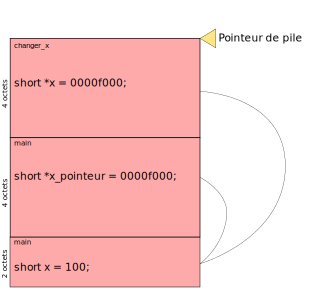

+++
title = "Les pointeurs"
weight = 2
description = "Le concept de pointeur est très important en C, et permet de gérer la mémoire de manière efficace. Ici, on explique à quoi ils servent et comment les utiliser."

[extra]
illus = "illus.webp"
+++

Comme on vient de le voir, quand on passe un paramètre à
une fonction, celui-ci est copié sur la pile pour la nouvelle
fonction. Ça fait que ce programme ne fait pas ce qu'on veut :

```c
void changer_x(short x) {
    x = 100;
}

int main() {
    short x = 0;
    changer_x(x);
    
    // x vaut toujours 0 ici

    return 1;
}
```

Dans la plupart des cas ce n'est pas vraiment un problème, mais parfois
ça peut être utile.

Pour contourner ce problème (et d'autres), on peut utiliser des pointeurs.

## Qu'est ce que c'est donc qu'on pointeur

Un pointeur est un type spécial qui est représenté comme un nombre
(32 bits de long sur les processeurs 32 bits, 64 bits de long sur les processeurs 64 bits),
et ce nombre contient l'adresse en mémoire d'une variable.

On peut ensuite indiquer à notre programme d'écrire ou de lire à cette addresse précise.

On peut voir ça comme une variable qui pointe vers une autre variable, d'où le nom pointeur.

Le type d'un pointeur vers une variable de type `X` s'écrit `X*` (ou `X *`, ça ne change rien).
Par exemple, si on veut faire un pointeur vers un int, on va utiliser une variable de type `int *`.

Pour créer un pointeur, on utilise l'opérateur `&` devant un nom de variable, qui peut se lire
comme « prend l'adresse dans la mémoire de cette variable ».

Pour **déréférencer** un pointeur, c'est-à-dire « aller à l'adresse mémoire indiquée par ce pointeur,
pour lire ou écrire à cette adresse, on utilise l'opérateur `*` devant le nom du pointeur.
Ça peut être un peu perturbant parce que c'est aussi le symbole utilisé dans les types de pointeurs (et dans les multiplications),
mais selon le contexte on arrive à deviner ce que cette étoile veut dire.

## Exemple d'utilisation

On va réécrire notre programme d'au-dessus avec un pointeur :

```c
void changer_x(short *x) { // on change le type de x ici
    *x = 100; // on déréférence le pointeur pour écrire à l'emplacement qu'il désigne
}

int main() {
    short x = 0;
    short *x_pointeur = &x; // on crée un pointeur vers x
    changer_x(x_pointeur); // on le passe à « changer_x » à la place de x
    
    // x vaut maintenant 100 !

    return 1;
}
```

Ça peut sembler un peu magique, donc je vous propose de… regarder ce qui se passe dans la mémoire !

On va reprendre notre mini pile, mais on va un peu l'agrandir (on va prendre 128 bits
pour la stocker au lieu de 64), et imaginer qu'on est sur une machine 32 bits.
Les addresses mémoires et donc les pointeurs auront une taille de 32 bits.

On va ajouter un détail par rapport à avant : à gauche de chaque octet je vais
écrire son adresse mémoire en héxadécimal (32 bits peuvent s'écrire avec 8 chiffres héxadécimaux).
On va dire que notre pile est stockée à l'adresse mémoire `0000f000`.
Au lancement de notre programme, on a donc :

```
ADRESSE  : VALEUR

0000f078 : 00000000
0000f070 : 00000000
0000f068 : 00000000
0000f060 : 00000000
0000f058 : 00000000
0000f050 : 00000000
0000f048 : 00000000
0000f040 : 00000000
0000f038 : 00000000
0000f030 : 00000000
0000f028 : 00000000
0000f020 : 00000000
0000f018 : 00000000
0000f010 : 00000000
0000f008 : 00000000
0000f000 : 00000000
```

Quand on crée `x`, il est ajouté sur la pile, mais comme il vaut zéro, le
changement n'est pas très visible, le pointeur de pile va juste bouger.
Ensuite on crée `x_pointeur`. `x` est stocké à l'adresse `0000f000`, donc
ça sera la valeur de `x_pointeur`. Ce nombre s'écrit `0000 0000 0000 0000 1111 0000 0000 0000`
en binaire.

```
ADRESSE  : VALEUR

0000f078 : 00000000
0000f070 : 00000000
0000f068 : 00000000
0000f060 : 00000000
0000f058 : 00000000
0000f050 : 00000000
0000f048 : 00000000
0000f040 : 00000000
0000f038 : 00000000
0000f030 : 00000000
0000f028 : 00000000  ← x_pointeur
0000f020 : 00000000  ← x_pointeur
0000f018 : 11110000  ← x_pointeur
0000f010 : 00000000  ← x_pointeur
0000f008 : 00000000  ← x
0000f000 : 00000000  ← x
```

On passe ensuite ce pointeur à la fonction `changer_x`, donc on copie sa valeur
sur la pile pour que la fonction puisse y accéder (comme on a deux variables `x`, je
rajoute les noms de fonctions entre parenthèses pour les différencier).

```
ADRESSE  : VALEUR

0000f078 : 00000000
0000f070 : 00000000
0000f068 : 00000000
0000f060 : 00000000
0000f058 : 00000000
0000f050 : 00000000
0000f048 : 00000000  ← x          (changer_x)
0000f040 : 00000000  ← x          (changer_x)
0000f038 : 11110000  ← x          (changer_x)
0000f030 : 00000000  ← x          (changer_x)
0000f028 : 00000000  ← x_pointeur (main)
0000f020 : 00000000  ← x_pointeur (main)
0000f018 : 11110000  ← x_pointeur (main)
0000f010 : 00000000  ← x_pointeur (main)
0000f008 : 00000000  ← x          (main)
0000f000 : 00000000  ← x          (main)
```

Quand on déréférence le pointeur, le programme lit l'adresse
stockée dans `x` (celui de `changer_x`), et va écrire à cette adresse
directement. On se retrouve donc avec :

```
ADRESSE  : VALEUR

0000f078 : 00000000
0000f070 : 00000000
0000f068 : 00000000
0000f060 : 00000000
0000f058 : 00000000
0000f050 : 00000000
0000f048 : 00000000  ← x          (changer_x)
0000f040 : 00000000  ← x          (changer_x)
0000f038 : 11110000  ← x          (changer_x)
0000f030 : 00000000  ← x          (changer_x)
0000f028 : 00000000  ← x_pointeur (main)
0000f020 : 00000000  ← x_pointeur (main)
0000f018 : 11110000  ← x_pointeur (main)
0000f010 : 00000000  ← x_pointeur (main)
0000f008 : 00000000  ← x          (main)
0000f000 : 01100100  ← x          (main)
```

Si vous regardez la valeur de `x` dans `main`, c'est maintenant `0000 0000 0110 0100`,
ce qui correspond à 100 en binaire.

Le programme va ensuite finir sa vie tranquillement, comme on a vu avant.

Si jamais cette montagne de nombre binaires et héxadécimaux n'est pas très claire,
essayez de dessiner la pile sur une feuille de papier. Voici un schéma qui représente
la pile juste au-dessus, mais avec une flèche pour représenter l'emplacement pointé
par le pointeur.



## Le pointeur nul et erreurs de segmentation

Il existe un pointeur spécial appelé le pointeur nul.
Ce pointeur correspond à l'adresse `0` de la mémoire,
et quand on le déréférence notre programme plante avec un
message ressemblant à « Segmentation fault ». Cette erreur
signifie qu'on a essayé d'accéder à une adresse « illégale ».

Pour créer un pointeur nul, on peut soit créer un pointeur avec `0`
comme valeur directement (au lieu d'utiliser un `&` pour récupérer une vraie adresse),
soit utiliser la constante `NULL`, qui est plus explicite.

```c
int *mon_pointeur = 0;
int *autre_pointeur = NULL;

// Ces lignes font planter le programme
// parce qu'on essaie de lire à l'adresse 0, qui est invalide.
int x = *mon_pointeur;
int y = *autre_pointeur; // Celle là n'est même jamais exécutée vu que le programme a déjà planté
```

Il existe d'autres addresses mémoire invalides que le pointeur nul.
Si vous créez un pointeur avec une valeur aléatoire, il y a de grandes
chances pour que vous tombiez à un endroit où vous n'avez pas le do

