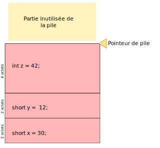

+++
title = "Stocker des variables"
weight = 1
description = "Ce chapitre explique comment sont stockées les variables en C, en expliquant le concept de pile."

[extra]
illus = "illus.webp"
+++

*Ce chapitre contient des simplifications, l'idée n'est pas d'être une
référence parfaite, mais de comprendre l'idée générale.*

Contrairement à d'autres langages, la gestion de la mémoire en C a une place assez importante.
On a un contrôle très précis de où et quand sont stockées les variables pendant l'exécution du
programme.

On va parler ici de mémoire vive (la RAM), pas de stockage sur un disque dur ou un serveur.
On ne parle que des données qui existent dans l'ordinateur pendant que notre programme
tourne, mais qui disparaissent aussitôt qu'il se termine. Autrement dit, on va parler
des variables uniquement.

La mémoire vive peut être vue comme une grande liste de bits. Chaque bit a un numéro
qu'on appelle son adresse dans la mémoire, et qui permet de le retrouver. L'ordinateur
est capable de lire un ou plusieurs bits à une adresse donnée, mais aussi d'y écrire.

Il existe plusieurs concepts liés à la mémoire, et les pages qui suivent vont les étudier plus en détail.
On va commencer par voir comment sont stockées des variables « simples ». Par exemple, comment la valeur de
`x` est-elle retenue par l'ordinateur dans ce programme ?

```c
int main() {
    short x = 12;
    short y = x + 3;

    printf("y vaut %d\n", y);

    return 0;
}
```

## La pile

Quand on lance un programme, le système d'exploitation lui donne
de la place dans la mémoire, pour stocker ses variables.

Cet espace est appelé **la pile**. Ce nom viens du fait que l'ordinateur
va « empiler » nos variables les unes à la suite des autres.

On va imaginer un système d'exploitation qui ne fait tourner que des tous petits programmes
et qui réserve juste 64 bits pour la pile d'un programme. On considère aussi
que la mémoire qui vient d'être donnée pour cette nouvelle pile est « propre » : tous
les bits sont 0, il n'y a aucune donnée pour le moment.
La pile ressemblerait alors à :

````
0000000000000000000000000000000000000000000000000000000000000000
````

Ce qui est très peu interéssant.

Dans la suite, je vais représenter la pile en la groupant par paquets de 8 bits (par octets).
C'est plus lisible, et la plupart des processeurs travaillent avec des octets plus
que des bits de toute façon. La pile se lira de bas en haut, puisqu'on empile les valeurs
les unes sur les autres (pensez à une pile d'assiettes). Du coup la pile d'au-dessus
devient :

```
00000000  ← Fin de la pile
00000000
00000000
00000000
00000000
00000000
00000000
00000000  ← Début de la pile
```

Il faut savoir que l'ordinateur garde en mémoire l'endroit où il en est de la pile
à tout moment, pour savoir où empiler les nouvelles variables, grâce à ce qu'on
appelle le « pointeur de pile » (*stack pointer* ou *SP* pour les intimes).
Cette information n'est pas stockée dans la mémoire vive, mais directement dans
le processeur (qui a de toutes petites mémoires qu'on appelle registres pour ce genre de choses).
Au début du programme, le « pointeur de pile » est au début de la pile.

Très bien, maintenant qu'on a une pile prête à stocker des variables, on peut commencer
l'exécution de notre programme. On va jouer au processeur, et exécuter les
instructions une à une, en commençant par la fonction `main`.

```c
short x = 12;
```

Là, on crée une nouvelle variable ! L'ordinateur va la stocker sur la pile, puisqu'elle
est là pour ça. 12 en binaire s'écrit `1100` (1×8 + 1×4 + 0×2 + 0×1, si vous avez des doutes).
On va donc écrire ça au début de la pile.

```
00000000
00000000
00000000
00000000
00000000
00000000
00000000
00001100  ← 12 !
```

Mais comme on écrit des données, il faut déplacer le pointeur de pile.
Le souci, c'est de savoir où le mettre. Heureusement, on sait que `x`
est de type `short`, ce qui prend 16 bits dans la mémoire sur la plupart
des ordinateurs. On avance donc de 16 bits, soit 2 octets vers le haut de la pile.

```
00000000
00000000
00000000
00000000
00000000
00000000  ← Le pointeur de pile est maintenant ici, tout ce qui est en dessous est réservé pour la valeur de x
00000000
00001100  ← Le 12 est toujours là
```

Passons à la ligne suivante :

```c
short y = x + 3;
```

On fait notre job de processeur et on calcule `x + 3`. Pour ça il faut
d'abord aller lire la valeur de `x`. On se souvient qu'il va du bit 0 au bit 15
de la pile, donc pas de souci. Maintenant on fait le calcul et on ajoute le résultat
sur la pile.

```
00000000
00000000
00000000
00000000  ← Le pointeur de pile est ici maintenant
00000000
00001111  ← 15 en binaire
00000000
00001100
```

## Les appels de fonctions

La ligne suivante est un peu plus complexe : on appelle une fonction.
Comme `printf` est une fonction un peu trop complexe pour un exemple
de base, on va la remplacer par autre chose. Disons ça :

```c
short moitie(short nombre) {
    short resulat = nombre / 2;
    return resultat;
}
```

Comment la pile se comporte-t-elle quand on fait `moitie(y);` dans le `main` ?

Tout d'abord, il faut passer les arguments à moitié. Chaque fonction est « isolée »
sur la pile, elle ne sait pas ce que les fonctions d'avant on fait et elles n'ont aucune
idée de ce qui se trouve sur la pile. C'est donc le travail de la fonction qui appelle
de copier la valeur des paramètres sur la pile avant d'exécuter la fonction appelée.
Cette dernière peut ainsi être sûre d'avoir ce qu'il faut pour fonctionner correctement.

On va donc ajouter une copie de `y` sur la pile :

```
00000000
00000000  ← Le pointeur de pile est maintenant ici
00000000
00001111  ← La copie de y (« nombre »), sur 16 bits
00000000
00001111  ← Le y original
00000000
00001100  ← x
```

On peut maintenant exécuter le code de `moitie`. On calcule `nombre / 2` et on met
le résultat sur la pile (qui est maintenant remplie, au passage).

```
00000000
00000111  ← 15 / 2 = 7 (pas vraiment, mais on va rester sur des nombres entiers, on touchera aux float un autre jour)
00000000
00001111
00000000
00001111
00000000
00001100
```

Maintenant, on fait le `return resultat;`. Quand elle `return`, la fonction
va « nettoyer » toute la partie de la pile dont elle avait besoin, et ne laisser
que la valeur retournée.

Le souci c'est qu'on ne peut pas décaler des valeurs comme on veut sur la pile :
on ne peut que dépiler (faire descendre le pointeur de pile, et éventuellement effacer des données)
ou empiler (le faire monter, et écrire des données). On ne peut donc pas enlever la valeur
de `nombre` sans enlever celle de `resultat` avant (qu'on veut garder). Encore une fois, c'est
un peu comme une pile d'assiette : on ne peut pas vraiment sortir une assiette en plein de la pile,
on est obligés d'enlever toutes celles par dessus avant.

L'astuce va être de stocker `resultat` pour un tout petit moment dans un registre du processeur
(les mini mémoires intégrées aux processeurs). Ensuite on le dépile, et on dépile 16 bits pour enlever
la valeur de `nombre` :

```
Registre quelconque : 0000000000000111 (7, la valeur de résultat)

Pile :

00000000
00000000
00000000
00000000  ← Le pointeur de pile est de nouveaux ici, et tout ce qui était au dessus a été néttoyé aussi
00000000
00001111
00000000
00001100
```

Puis on ré-empile a valeur sauvegardée dans le registre qu'on avait choisi :

```
00000000
00000000  ← Le pointeur de pile est de retour ici, mais si on regarde les deux octets en dessous, on a le 7
00000000
00000111 
00000000
00001111
00000000
00001100
```

Et on peut revenir au code de la fonction `main` !

Dans la vraie vie, dépiler des données ne réécrit pas des zéros par dessus, en général.
Le pointeur de pile est juste déplacé vers le bas. Ça évite des opérations inutiles
puisque de toute façon d'autres variables vont sans doute être ré-empilées par dessus
juste après, effaçant leurs valeurs.

### Stack Overflow

Vous avez peut-être déjà eu une erreur qui disait « Stack overflow », ou quelque chose
de semblable. Cette erreur est liée au fonctionnement de la pile : ça veut dire que vous
avez débordé de votre pile, vous y avez stocké trop de variables sans les dépiler.
Ça arrive assez souvent quand on a des fonctions récursives, par exemple :

```c
int main() {
    int x = 12;
    main();
    return 0;
}
```

Va empiler `12` (en prenant 32 bits à chaque fois, vu qu'on utilise un `int` pour `x`) à l'infini.
Notre petite pile de 64 bits serait remplie instantannément, et même dans la vraie vie où on a des piles
bien plus grandes, on arriverait vite à la même erreur.

## De jolis dessins

Plutôt que d'écrire des 0 et des 1 dans tous les sens, on peut
utiliser d'autres représentations pour la pile.

Pour commencer, on peut écrire en héxadécimal, qui à l'avantage de
bien coller au binaire en terme de taille dans la mémoire : 4 bits
représentent un nombre de 0 à 15, c'est à dire un chiffre en base 16.
On peut donc écrire un octet avec seuleument 2 chiffres héxadécimaux,
ce qui est plus compacte, et avec un peu d'entraînement beaucoup plus
simple à lire que du binaire.

La base 10 est bien sûr encore plus simple à lire, mais elle ne « colle »
pas niveau taille : la valeur maximale d'une variable n'est pas claire visuellement.
Par exemple si on prend un `char`, qui fait un octet, de valeur maximale (255) :

- en binaire c'est `11111111` ;
- en héxadécimal c'est `ff` (f = 15, donc 16×15 + 15 = 255) ;
- en décimal c'est `255`, et à moins de savoir que c'est la valeur maximale, rien n'indique clairement
  qu'on a plus de place, alors que pour les autres on a le dernier chiffre existant (1 et f respectivement)
  qui se répètent.

Mais encore mieux que d'écrire juste du texte, on peut faire des dessins pour se
représenter une pile, et la mémoire vive de manière générale :



Ce genre de dessin peut être très utile quand on a un bug de mémoire qu'on
a du mal à comprendre, ou juste quand on essaie d'apprendre comment fonctionne
la mémoire, donc n'hésitez pas à en faire en lisant ce cours.
